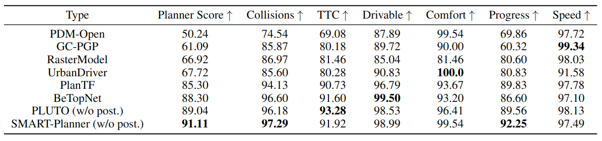

<div align="center">
  
  # SMART: Scalable Multi-agent Real-time Motion Generation via Next-token Prediction
  
  [Paper](https://arxiv.org/abs/2405.15677) | [Webpage](https://smart-motion.github.io/smart/)

</div>

- **Ranked 1st** on the [Waymo Open Sim Agents Challenge 2024](https://waymo.com/open/challenges/2024/sim-agents/)  
- **Champion** of the [Waymo Open Sim Agents Challenge 2024](https://waymo.com/open/challenges/2024/sim-agents/) at the [CVPR 2024 Workshop on Autonomous Driving (WAD)](https://cvpr2024.wad.vision/)

## News
- **[December 31, 2024]** SMART-Planner achieved state-of-the-art performance on **nuPlan closed-loop planning**
- **[September 26, 2024]** SMART was **accepted to** NeurIPS 2024
- **[August 31, 2024]** Code released
- **[May 24, 2024]** SMART won the championship of the [Waymo Open Sim Agents Challenge 2024](https://waymo.com/open/challenges/2024/sim-agents/) at the [CVPR 2024 Workshop on Autonomous Driving (WAD)](https://cvpr2024.wad.vision/)
- **[May 24, 2024]** SMART paper released on [arxiv](https://arxiv.org/abs/2405.15677)


## Introduction
This repository contains the official implementation of SMART: Scalable Multi-agent Real-time Motion Generation via Next-token Prediction. SMART is a novel autonomous driving motion generation paradigm that models vectorized map and agent trajectory data into discrete sequence tokens.

## Requirements

To set up the environment, you can use conda to create and activate a new environment with the necessary dependencies:

```bash
conda env create -f environment.yml
conda activate SMART
pip install -r requirements.txt
```

If you encounter issues while installing pyg dependencies, execute the following script:
```setup
bash install_pyg.sh
```

Alternatively, you can configure the environment in your preferred way. Installing the latest versions of PyTorch, PyG, and PyTorch Lightning should suffice.

## Data installation

**Step 1: Download the Dataset**

Download the Waymo Open Motion Dataset (`scenario protocol` format) and organize the data as follows:
```
SMART
├── data
│   ├── waymo
│   │   ├── scenario
│   │   │   ├──training
│   │   │   ├──validation
│   │   │   ├──testing
├── model
├── tools
```

**Step 2: Install the Waymo Open Dataset API**

Follow the instructions [here](https://github.com/waymo-research/waymo-open-dataset) to install the Waymo Open Dataset API.

**Step 3: Preprocess the Dataset**

Preprocess the dataset by running:
```
python data_preprocess.py --input_dir ./data/waymo/scenario/training  --output_dir ./data/waymo_processed/training
```
The first path is the raw data path, and the second is the output data path.

The processed data will be saved to the `data/waymo_processed/` directory as follows:

```
SMART
├── data
│   ├── waymo_processed
│   │   ├── training
│   │   ├── validation
│   │   ├──testing
├── model
├── utils
```

## Training

To train the model, run the following command:

```train
python train.py --config ${config_path}
```

The default config path is `configs/train/train_scalable.yaml`. Ensure you have downloaded and prepared the Waymo data for training.

## Evaluation

To evaluate the model, run:

```eval
python eval.py --config ${config_path} --pretrain_ckpt ${ckpt_path}
```
This will evaluate the model using the configuration and checkpoint provided.


## Pre-trained Models

To comply with the WOMD participation agreement, we will release the model parameters of a medium-sized model not trained on Waymo data. Users can fine-tune this model with Waymo data as needed.

## Results

### Waymo Open Motion Dataset Sim Agents Challenge

Our model achieves the following performance on the [Waymo Open Motion Dataset Sim Agents Challenge](https://waymo.com/open/challenges/2024/sim-agents/):

| Model name    | Metric Score |
| :-----------: | ------------ |
| SMART-tiny    | 0.7591       |
| SMART-large   | 0.7614       |
| SMART-zeroshot| 0.7210       |

### NuPlan Closed-loop Planning

**SMART-Planner** achieved state-of-the-art performance among learning-based algorithms on **nuPlan closed-loop planning**. The results on val14 are shown below:



## Citation 

If you find this repository useful, please consider citing our work and giving us a star:

```citation
@article{wu2024smart,
  title={SMART: Scalable Multi-agent Real-time Simulation via Next-token Prediction},
  author={Wu, Wei and Feng, Xiaoxin and Gao, Ziyan and Kan, Yuheng},
  journal={arXiv preprint arXiv:2405.15677},
  year={2024}
}
```

## Acknowledgements
Special thanks to the [QCNET](https://github.com/ZikangZhou/QCNet) repository for providing valuable reference code that significantly influenced this work. 

## License
All code in this repository is licensed under the [Apache License 2.0](https://www.apache.org/licenses/LICENSE-2.0).
